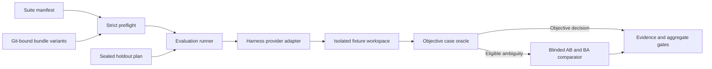

# Harness Evals

[](https://github.com/Dhi13man/harness-evals/actions/workflows/ci.yml) [](https://github.com/Dhi13man/harness-evals/actions/workflows/codeql.yml) [](https://scorecard.dev/viewer/?uri=github.com/Dhi13man/harness-evals) [](LICENSE)

Harness Evals is an open source evaluation system for comparing software engineering and testing instruction bundles through coding harnesses. It combines isolated agent execution, objective case-specific verifiers, calibrated blinded pairwise comparison, immutable source bindings, bounded spend accounting, and review-sealed holdout support.

The evaluator is independent of any private harness configuration and does not require the skill names that motivated its first corpus. The included reference suite uses neutral `engineering` and `testing` bundle identifiers; another suite may use any valid identifier and Git repository that follows the documented `skills/<id>/SKILL.md` bundle layout. Provider adapters are the extension boundary for additional coding harnesses.

Version `0.1.0` is an alpha release for expert evaluation work on Linux. The public corpus contains train and validation cases, not a private holdout, and the repository does not ship live comparator certification evidence or claim that one harness or bundle is superior.

## What Is Included

- Seventeen calibrated tasks covering implementation correctness, compatibility, security, concurrency, performance, simplicity, test-oracle sensitivity, boundary fidelity, stateful behavior, flake control, characterization, and idempotency.
- Strict JSON manifests with duplicate-key rejection, bounded input handling, source-tree hashing, Git reference binding, and drift detection.
- Claude CLI generation and comparison support plus a serialized Codex app-server diagnostic adapter.
- Per-case objective oracles with known-good, known-bad, and adversarial calibration variants.
- Blinded AB/BA comparison with a locked rubric, corpus, schemas, provider identity, spend journal, and certification contract.
- One-shot externally reviewed holdout plans that bind exact task content, source commits, provider configuration, and comparator evidence.

## Architecture



The runner treats prompts, fixtures, generated code, provider output, and comparator responses as untrusted. Git sources, suite bytes, verifier trees, runtime adapters, and release locks are hashed and rechecked across the run. Linux user namespaces and transient `systemd --user` units isolate provider processes and deny access to the host repository, suite, credentials, and unrelated paths except for narrowly declared read-only bindings.

## Requirements

- Linux with a working `systemd --user` manager.
- util-linux `unshare`, `mount`, and `setpriv`, with unprivileged user and mount namespaces enabled.
- Python 3.11 or newer.
- Git, Go, and Node.js for the included language fixtures.
- An authenticated supported provider executable only for provider-backed runs.

The runtime package has no third-party Python dependencies. Development and CI tools are separate.

## Quick Start

```bash
git clone https://github.com/Dhi13man/harness-evals.git
cd harness-evals
python3 -m venv .venv
. .venv/bin/activate
python -m pip install --upgrade pip
python -m pip install -e .
python -m unittest discover -s tests -v
python -m unittest discover -s harness_evals/comparator_calibration/tests -v
python cases/software/calibrate.py
python cases/testing/calibrate.py
```

Run the packaged command from the repository root:

```bash
harness-evals --comparison original-vs-no-skill --dry-run
```

Dry runs validate the manifest, tools, source references, cases, provider protocol locks, and selection without invoking a model or writing result artifacts. Provider validation still requires the configured executable and its local runtime prerequisites.

Run objective verifiers without comparator judgments:

```bash
harness-evals --comparison candidate-vs-original --verifier-only --output-dir /tmp/harness-evals-verifier
```

This command still invokes the configured generation provider. A non-dry run can consume metered API spend or subscription quota. The manifest and preflight report per-call and run ceilings before dispatch; an unknown exact charge is accounted at the configured ceiling.

## Suite Contract

The root [suite.json](suite.json) is a complete repository-local reference suite. Its baseline is a pinned Git commit and its candidate is the current committed worktree. It demonstrates the source contract without depending on another repository.

| Component | Purpose |
| --- | --- |
| `provider` | Generates a change in an isolated fixture workspace. |
| `comparator` | Judges eligible pairs using the locked blinded protocol. |
| `variants` | Bind absent, immutable Git-ref, or committed-worktree instruction bundles. |
| `comparisons` | Define control/treatment roles, exactly three repetitions, and AB/BA order. |
| `cases` | Bind a prompt, fixture, verifier, bundle ID, explicit context, expectations, and comparator contract. |

The executable parser in [harness_evals/manifest.py](harness_evals/manifest.py) is authoritative. [suite.schema.json](suite.schema.json) is the editor and interoperability contract; changes must keep both in exact behavioral parity.

To evaluate bundles in another repository, copy the manifest, set `repository_root`, point worktree variants at that repository, replace Git refs with commits reachable there, and update every case's bundle ID and explicit context files. Do not move a baseline by editing only the manifest: `baseline-authority.json`, comparator runtime bindings, and any sealed holdout plan must be regenerated and reviewed together.

## Adding A Case

1. Add `prompt.md`, a minimal `fixture/`, and `oracle/verify.py` under the appropriate corpus track.
2. Add at least one known-good and one known-bad calibration generator. Add focused adversarial variants for oracle bypasses and boundary mistakes.
3. When a variant targets selected assertions, add `expect.json` whose `must_pass` and `must_fail` lists exactly partition every emitted assertion.
4. Add the case contract to the suite and identify every critical expectation.
5. Run the track calibrator, the complete unit suite, Ruff, compilation, and the known-good production-sandbox smoke test.

Case oracles must judge observable requirements, resist implementation-name and evaluator-environment branching, bound time and resources, and prove sensitivity to their intended defects. See [CONTRIBUTING.md](CONTRIBUTING.md) for the acceptance checklist.

## Providers

The built-in Claude adapter is release-authoritative when its exact executable, runtime, model, isolation properties, and live comparator certification satisfy the release locks. The Codex app-server adapter is diagnostic: it validates a pinned standalone CLI and protocol bundle, disables unrelated bundled skills, and records subscription-quota metadata, but cannot satisfy the current generator-authority gate for a release holdout.

New providers implement the `EvalProvider` contract in [harness_evals/providers.py](harness_evals/providers.py). Provider contributions must preserve dispatch journaling, source and request bindings, cleanup guarantees, credential isolation, cost or quota provenance, deterministic test doubles, and fail-closed authority checks.

## Holdouts And Claims

The checked-in suite intentionally has no holdout cases. A release claim requires a separately stored private suite frozen before candidate evaluation, independent reviewers, fresh live comparator certification, an externally written mode-`0600` holdout plan, the canonical candidate comparisons, and a single consumed execution record. These controls reduce accidental leakage and reruns; they are not cryptographic proof against a hostile same-UID process or a compromised host.

Prepare a reviewed plan with:

```bash
harness-evals-prepare-holdout --suite /secure/evals/suite.json --output /secure/evals/plan.json --plan-id release-v1 --reviewer reviewer-a --reviewer reviewer-b --freeze-record review:freeze:release-v1 --seal-record review:seal:release-v1
```

Every non-dry holdout attempt consumes its plan before any agent or comparator call, including failed and interrupted runs. There is no holdout resume.

## Versioning

The Python package follows Semantic Versioning. Before `1.0.0`, minor versions may change the Python API or CLI with changelog and migration notes. Manifest schema versions, corpus versions, comparator protocol versions, and release-lock versions are independent compatibility surfaces and are never inferred from the package version.

- Package and CLI: `0.1.0`
- Suite manifest schema: `2`
- Included suite: `harness-evals-software-engineering-v1`
- Comparator evaluator: `2.3.0`

See [CHANGELOG.md](CHANGELOG.md) for release changes and [GOVERNANCE.md](GOVERNANCE.md) for decision and release authority.

## Security And Support

Do not report vulnerabilities in a public issue. Follow [SECURITY.md](SECURITY.md) for private reporting, supported versions, and the project trust boundary. Usage questions and non-sensitive failures belong in [GitHub Discussions](https://github.com/Dhi13man/harness-evals/discussions) or an issue selected through [SUPPORT.md](SUPPORT.md).

## Contributing

Contributions are welcome under [CONTRIBUTING.md](CONTRIBUTING.md) and the [Contributor Covenant](CODE_OF_CONDUCT.md). By contributing, you agree that your contribution is licensed under the MIT License and affirm that you have the right to submit it.

## License

Harness Evals is released under the [MIT License](LICENSE).
