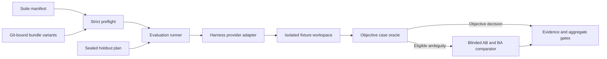

# Harness Evals

[](https://github.com/Dhi13man/harness-evals/actions/workflows/ci.yml) [](https://github.com/Dhi13man/harness-evals/actions/workflows/codeql.yml) [](https://scorecard.dev/viewer/?uri=github.com/Dhi13man/harness-evals) [](LICENSE)

Harness Evals is an open source system for running reproducible A/B evaluations of skills and instruction bundles through agent harnesses. It combines isolated agent execution, objective case-specific verifiers, calibrated blinded pairwise comparison, immutable source bindings, bounded spend accounting, and review-sealed holdout support.

A suite defines its own skill identifiers, bundle locations, tasks, fixtures, verifier resources, and comparison arms. The included engineering and testing tracks are the first reference corpus, not the evaluator's domain boundary; suites may target any configured instruction bundle with cases that exercise its observable behavior. Harness integrations live behind provider adapters.

Version `0.3.0` is an alpha release for expert evaluation work on Linux. The public corpus contains train and validation cases, not a private holdout, and the repository does not ship live comparator certification evidence or claim that one harness or bundle is superior. The production-authority blinded comparator is calibrated for software-change evidence. A test-authority plain-language profile proves that non-engineering semantics can use the shared engine, but its corpus is an author-authored fixture rather than independent production calibration. Other domains should use objective case verifiers or contribute a separately calibrated comparator profile rather than reusing either rubric without validation.

## What Is Included

- A reference corpus of seventeen calibrated engineering and testing tasks covering implementation correctness, compatibility, security, concurrency, performance, simplicity, test-oracle sensitivity, boundary fidelity, stateful behavior, flake control, characterization, and idempotency.
- Strict JSON manifests with duplicate-key rejection, bounded input handling, source-tree hashing, Git reference binding, and drift detection.
- Built-in Claude CLI generation and comparison support plus an optional serialized Codex app-server diagnostic adapter.
- Per-case objective oracles with known-good, known-bad, and adversarial calibration variants.
- Blinded AB/BA comparison with a locked rubric, corpus, schemas, provider identity, spend journal, and certification contract.
- One-shot externally reviewed holdout plans that bind exact task content, canonical per-variant sources, provider configuration, and mode-specific judgment authority.

## Architecture



The runner treats prompts, fixtures, generated code, provider output, and comparator responses as untrusted. Git sources, suite bytes, verifier trees, runtime adapters, and release locks are hashed and rechecked across the run. Linux user namespaces and transient `systemd --user` units isolate provider processes and deny access to the host repository, suite, credentials, and unrelated paths except for narrowly declared read-only bindings.

## Requirements

- Linux with a working `systemd --user` manager.
- util-linux `unshare`, `mount`, and `setpriv`, with unprivileged user and mount namespaces enabled.
- Python 3.11 or newer.
- Git, Go, and Node.js for the included language fixtures.
- An authenticated supported provider executable only for provider-backed runs.

The runtime package has one exact third-party Python dependency for RFC 8785 JSON canonicalization. Development, test, build, and fuzz tools are separately hash-locked for CI.

## Quick Start

Install and verify the published 0.3.0 wheel with a GitHub CLI release that provides `gh attestation`:

```bash
mkdir -p /tmp/harness-evals-0.3.0
gh release download v0.3.0 --repo Dhi13man/harness-evals --pattern "harness_evals-0.3.0*" --pattern SHA256SUMS --dir /tmp/harness-evals-0.3.0
(cd /tmp/harness-evals-0.3.0 && sha256sum --check SHA256SUMS)
gh attestation verify /tmp/harness-evals-0.3.0/harness_evals-0.3.0-py3-none-any.whl --repo Dhi13man/harness-evals
python -m pip install /tmp/harness-evals-0.3.0/harness_evals-0.3.0-py3-none-any.whl
```

For source development:

```bash
git clone https://github.com/Dhi13man/harness-evals.git
cd harness-evals
python3 -m venv .venv
. .venv/bin/activate
python -m pip install --upgrade pip
python -m pip install -e ".[test]"
python -m unittest discover -s tests -v
python -m unittest discover -s harness_evals/comparator_calibration/tests -v
python cases/software/calibrate.py
python cases/testing/calibrate.py
```

Run the packaged command from the repository root:

```bash
harness-evals --comparison original-vs-no-skill --dry-run
```

Dry runs validate the manifest, tools, source references, cases, provider protocol locks, and selection without invoking a model or writing result artifacts. Provider validation still requires the configured executable and its local runtime prerequisites.

Run objective verifiers without comparator judgments:

```bash
harness-evals --comparison candidate-vs-original --verifier-only --output-dir /tmp/harness-evals-verifier
```

This command still invokes the configured generation provider. A non-dry run can consume metered API spend or subscription quota. The manifest and preflight report per-call and run ceilings before dispatch; an unknown exact charge is accounted at the configured ceiling.

## Suite Contract

The root [suite.json](suite.json) is a complete repository-local reference suite. Its baseline is a pinned Git commit and its candidate is the current committed worktree. It demonstrates the source contract without depending on another repository.

| Component | Purpose |
| --- | --- |
| `evaluation_mode` | Selects comparator-judged or objective-verifier-only evaluation in schema v3 or newer. |
| `provider` | Generates a change in an isolated fixture workspace; schema v6 selects a reviewed `adapter`. |
| `comparator` | Judges eligible pairs using the locked blinded protocol; schema v6 selects a reviewed `adapter`. |
| `comparator_profile` | Selects the versioned comparator contract and resources for schema-v3-or-newer judged suites. |
| `shared_verifier_dir` | In schema v4 or newer, selects one contained read-only verifier resource directory or explicitly disables shared resources with `null`. |
| `holdout` | In schema v5 or newer, selects the ordered comparison IDs authorized for release evaluation. |
| `variants` | Bind absent, immutable Git-ref, or committed-worktree instruction bundles. |
| `comparisons` | Define control/treatment roles, exactly three repetitions, and AB/BA order. |
| `cases` | Bind a prompt, fixture, verifier, bundle ID, schema-v4-or-newer `bundle_source`, explicit context, expectations, schema-v7 `artifact_contract`, and, for judged suites, a comparator contract. |

The executable parser in [harness_evals/manifest.py](harness_evals/manifest.py) is authoritative. [suite.schema.json](suite.schema.json) is the editor and interoperability contract; changes must keep both in exact behavioral parity.

To evaluate bundles in another repository, copy the manifest, set `repository_root`, point worktree variants at that repository, replace Git refs with commits reachable there, and update every case's bundle ID, bundle source, and explicit context files. Suite files and shared verifier resources may use any contained layout; they do not need to mirror the evaluated repository. Schema-v2 through schema-v4 holdouts retain the release-owned `original` baseline adapter. Schema-v5-or-newer holdouts bind every selected source directly in a newly reviewed plan instead of deriving source authority from the comparator release.

### Evaluation Modes

Schema v2 remains supported without changing existing manifest bytes, manifest hashes, or result field shapes and selects the current software comparator through its compatibility path. Schema v3 adds an explicit `evaluation_mode`; schema v4 adds explicit layout paths; schema v5 adds suite-owned release comparison selection and generic sealed source authority; schema v6 replaces provider `kind` values with reviewed adapter IDs and seals provider capability authority; schema v7 adds explicit case artifact contracts. Schema-v2 and schema-v3 compatibility paths derive each bundle from `skills/<skill>` and discover `cases/testing/_shared` when that legacy directory exists. Comparator release and certification hashes still change when their locked code or resources change.

- `judged` requires both `comparator` and `comparator_profile`, and every case requires `comparator_contract`.
- `objective_only` forbids `comparator`, `comparator_profile`, and every case-level `comparator_contract`. The runner constructs no comparator provider or runtime, creates no comparator spend ledger, selects the sole verifier-passing arm, and records equal verifier outcomes as `tie` under `verifier-pass-v1`.

Objective-only schema-v3 and schema-v4 execution remains diagnostic. Schema v5 or newer may prepare and consume a production holdout without constructing a comparator: the plan seals the canonical `verifier-pass-v1` acceptance policy, and the normal source, provider, review, one-shot, case-integrity, and aggregate gates still apply.

### Layout Paths

Schema v4 requires every case to declare a canonical repository-relative `bundle_source` whose root contains a regular `SKILL.md`. It also requires suite-level `shared_verifier_dir`: use a canonical suite-relative directory for immutable shared verifier resources or `null` when no shared resources exist. Configured shared resources must not overlap prompts, fixtures, evaluated bundles, or explicit context files.

Git-ref and worktree variants use the same bounded source policy. Bundle paths are treated as literal Git paths, special entries and symlink traversal fail closed, configured source bytes must match the pinned commit, and schema-v4 generated caches and untracked empty directories do not alter the evaluated snapshot. Shared resources are snapshotted before dispatch, hash-bound into case and holdout evidence, translated into the private verifier runtime, and mounted read-only. A schema-v4 `null` exposes neither a shared mount nor `EVAL_SHARED_ROOT`.

### Artifact Contracts

Schema v7 requires every case to declare exactly one artifact contract:

```json
{
  "artifact_contract": {
    "kind": "final_output_json"
  }
}
```

The closed kinds are `workspace_diff`, `final_output_text`, and `final_output_json`. Schema-v2 through schema-v6 cases retain the `workspace_diff` compatibility default without changing their manifest bytes, hashes, or historical case fingerprints. Schema-v7 case fingerprints bind the explicit artifact kind.

Raw semantic output and normalized content are independently capped at 1 MiB. Text rejects invalid UTF-8 and a leading BOM, converts CRLF and CR to LF, and otherwise preserves Unicode, whitespace, and terminal-newline state. JSON rejects a leading BOM, duplicate keys, non-finite or oversized number tokens, trailing content, scalar roots, excessive depth or members, and oversized strings, then canonicalizes through RFC 8785. Evidence records the fixed filename, media type, canonicalization contract, raw and normalized byte counts, and SHA-256.

Verifiers receive canonical bytes through a separate read-only `EVAL_ARTIFACT_PATH` with `EVAL_ARTIFACT_KIND` and `EVAL_ARTIFACT_SHA256`. Workspace-diff verifiers retain a disposable copy of the candidate workspace. Final-output verifiers receive a pristine read-only fixture workspace, so candidate files cannot substitute the declared output or influence verification through undeclared workspace mutations.

Objective-only suites may use all three artifact kinds. Judged suites additionally require their selected comparator profile to list the kind in `supported_artifact_kinds`; the bundled calibrated profiles currently remain `workspace_diff`-only, so judged final-output suites fail preflight before provider or comparator dispatch. Adding judged text or JSON support requires a separately reviewed and calibrated profile rather than treating output as a patch.

The installed-wheel smoke builds a schema-v4 suite outside the checkout and site-packages with `instruction-bundles/demo`, `oracle-resources/common`, and `cases/basic`. It binds the exact external worktree commit, bundle fingerprint, shared-tree hash, and verifier path through the installed CLI.

### Holdout Source Authority

Schema v5 declares release comparisons in manifest order:

```json
{
  "schema_version": 5,
  "holdout": {
    "comparison_ids": ["reference-vs-treatment", "empty-vs-treatment"]
  }
}
```

The selected comparison IDs and their control and treatment variant IDs are suite-owned; no reserved names are required. Release comparisons retain three repetitions and `ab_ba` ordering. Every selected skill still requires at least eight unique holdout task fingerprints.

Schema-v5 suites prepare holdout-plan schema v3; schema-v6-or-newer suites prepare schema v4. Both versions seal generic source authority. Each sorted `source_bindings[]` entry seals the variant ID, variant kind, nullable source commit, and an exact sorted case-to-fingerprint map. A `without_skill` binding uses the canonical empty-source digest. Git-ref and worktree fingerprints share one versioned domain-separated preimage containing the bundle locator, sorted relative paths, file bytes, executable bits, and declared context paths and bytes. Equal evaluated sources in either arm fail before dispatch even when their commit IDs differ.

Judged plans seal the registered comparator profile descriptor, authority registry, release, and live certification evidence. Objective-only plans forbid comparator fields and seal the canonical verifier acceptance policy instead. Source authority is identical in both modes. Plan v4 additionally seals role-specific generator and comparator adapter bindings over the reviewed capability digest, contract revision, authority scope, normalized non-secret configuration, runtime provenance, and complete binding digest.

To adopt generic source authority, migrate an unconsumed suite to schema v5, add `holdout.comparison_ids` in manifest comparison order, validate the suite, and prepare a new external plan. To adopt provider capability authority, migrate that suite to schema v6 and replace each provider `kind` with its reviewed adapter ID: `claude` becomes `claude-cli`, `codex` becomes `codex-app-server`, and `fake` becomes `deterministic-fake`. To adopt declared outputs, migrate to schema v7 and add one `artifact_contract` to every case. Validate after each migration and prepare a new plan v4. Provider capability revision 2 adds final-output capture, so unconsumed plan-v4 files created against revision 1 must be re-prepared; never rewrite a reviewed or consumed plan. Plan v2 remains readable only for compatible schema-v2 through schema-v4 suites; plan v3 remains readable only for compatible schema-v2 through schema-v5 suites and cannot authorize schema v6 or v7.

### Comparator Profiles

A judged schema-v3-or-newer suite selects either a registered built-in profile or a contained suite-local data profile:

```json
{
  "evaluation_mode": "judged",
  "comparator_profile": {
    "kind": "builtin",
    "id": "software-engineering-v2.3"
  }
}
```

Built-in profiles resolve from installed package resources through a code-owned registry. The registry binds the exact descriptor, production and test releases, and certification contract. Wheel and sdist CI inspects every descriptor-declared resource, compares their bytes, rejects unexpected profile data, installs the wheel in a clean environment, and dry-runs an external suite through the installed CLI without importing the checkout.

A suite-local profile uses `{"kind": "suite_local", "path": "profiles/example"}`. Its path must be canonical, contained, and free of symlinks. Its descriptor may declare only data resources; calibration, collection, certification, and comparison code always come from the installed package. A suite-local profile cannot reuse a built-in ID, claim registry authority, prepare or consume a holdout, or authorize a release, even when all of its internal hashes and certification evidence are self-consistent.

Packaged built-in profiles preserve the legacy certification location at `harness_evals/comparator_calibration/evidence/` when that checkout layout exists. An external installed-package suite uses `comparator-evidence/<profile-id>/certification.json`; the certification's `evidence_path` is relative to that same profile-specific directory. Certification and evidence files are enforced as owner-only regular files. Their existing non-symlink parent directory should be mode `0700`; directory permissions remain the suite operator's responsibility.

#### Semantic Contracts And Authority

Every profile release binds a strict `semantic-contract.json` alongside its rubric, corpus, request template, response schema, evidence schema, and release metadata. The semantic contract selects a reviewed closed engine strategy and adapters, then owns criterion IDs, requirement kinds, qualitative and performance basis vocabularies, corpus identity, calibration policy, and criterion-support thresholds. Suite case contracts are parsed against the selected profile's immutable vocabulary; the more general JSON schema validates their structure without hard-coding one domain's criterion names.

Profiles do not supply executable evaluator code. Engine strategies and adapters remain an explicit allowlist in the installed package, so a data profile cannot introduce an import path, expression language, or arbitrary parser. Adding a new semantic shape that the closed engine cannot represent requires a normal reviewed code contribution.

Authority is separate from internal hash consistency:

- `software-engineering-v2.3` is registered with production scope, but production judgment and holdout access still require exact external source bindings and fresh live certification.
- `plain-language-revision-v1` is registered with test scope. It exercises four non-engineering criteria, balanced AB/BA outcomes, prompt-injection probes, length-bias probes, package loading, and shared-engine judgment, but it cannot load a production release, prepare or consume a holdout, or authorize a claim.
- Suite-local profiles are diagnostic data. They can execute public judged evaluations through the shared engine, but have no registry authority and cannot cross a production holdout boundary.

The runner checks code-owned scope, non-test release status, exact external bindings, and certification independently. Test scope, a test release, missing registry authority, or stale external bindings each fail closed before protected holdout cases, sources, plans, outputs, spend ledgers, or providers are reached.

#### Adding A Comparator Profile

1. Define a data-only descriptor and semantic contract using an existing closed engine strategy and adapters.
2. Provide a strict corpus schema, rubric, request template, response schema, evidence schema, balanced adjudicated corpus, and explicit production and test release locks.
3. Preserve review provenance honestly. Author-authored fixture labels are acceptable for test authority but must not be described as independent calibration.
4. Calibrate every decisive criterion with the semantic support required by the contract, not merely AB/BA presentation balance. Unsupported criteria must remain tie-only.
5. Include outcome sentinels, adversarial instruction probes, length-bias coverage, malformed-resource tests, cross-profile substitution tests, and a grounded end-to-end judgment test.
6. Prove both release files and the authority registry reproduce byte-for-byte, then inspect wheel and sdist contents and load the runtime from a clean installed environment.
7. Register a built-in ID or grant production scope only through code review. A self-consistent suite-local profile never promotes itself.

## Adding A Case

1. Add `prompt.md`, a minimal `fixture/`, and `oracle/verify.py` under the appropriate corpus track.
2. Add at least one known-good and one known-bad calibration generator. Add focused adversarial variants for oracle bypasses and boundary mistakes.
3. When a variant targets selected assertions, add `expect.json` whose `must_pass` and `must_fail` lists exactly partition every emitted assertion.
4. Add the case contract to the suite and identify every critical expectation.
5. Run the track calibrator, the complete unit suite, Ruff, compilation, and the known-good production-sandbox smoke test.

Case oracles must judge observable requirements, resist implementation-name and evaluator-environment branching, bound time and resources, and prove sensitivity to their intended defects. See [CONTRIBUTING.md](CONTRIBUTING.md) for the acceptance checklist.

## Providers

Built-in harness integrations conform to the `EvalProvider` contract in [harness_evals/providers.py](harness_evals/providers.py). Schema v6 selects adapters from the immutable reviewed registry in [harness_evals/provider_capabilities.py](harness_evals/provider_capabilities.py); arbitrary manifest-supplied imports and capability declarations are not supported. Each registry entry fixes its roles, contract revision, concurrency, sandbox, authority scope, billing evidence, provenance fields, and artifact outputs, and its canonical digest is included in the locked release inputs.

`claude-cli` supports generation and comparison with production authority. `codex-app-server` is a serialized diagnostic generation adapter with subscription-quota provenance. `deterministic-fake` supports generation and comparison only under test authority. A production schema-v6-or-newer holdout additionally requires manifest-built, non-injected Claude generator and comparator instances, exact executable and runtime bindings, sealed plan-v4 authority, and live comparator certification. Provider names, injected instances, suite fields, and provider results cannot elevate their own authority. Neither provider determines which skill domains a suite may evaluate.

New provider contributions must preserve dispatch journaling, source and request bindings, cleanup guarantees, credential isolation, cost or quota provenance, deterministic test doubles, and fail-closed authority checks.

## Holdouts And Claims

The checked-in suite intentionally has no holdout cases. A release claim requires a separately stored private suite frozen before candidate evaluation, independent reviewers, an externally written mode-`0600` holdout plan, the suite-declared release comparisons, and a single consumed execution record. Judged claims additionally require fresh live comparator certification; objective-only claims bind the reviewed verifier policy and construct no comparator. These controls reduce accidental leakage and reruns; they are not cryptographic proof against a hostile same-UID process or a compromised host.

Prepare a reviewed plan with:

```bash
harness-evals-prepare-holdout --suite /secure/evals/suite.json --output /secure/evals/plan.json --plan-id release-v1 --reviewer reviewer-a --reviewer reviewer-b --freeze-record review:freeze:release-v1 --seal-record review:seal:release-v1
```

Every non-dry holdout attempt consumes its plan before any agent or comparator call, including failed and interrupted runs. There is no holdout resume.

## Versioning

The Python package follows Semantic Versioning. Before `1.0.0`, minor versions may change the Python API or CLI with changelog and migration notes. Manifest schema versions, corpus versions, comparator protocol versions, and release-lock versions are independent compatibility surfaces and are never inferred from the package version.

- Package and CLI: `0.3.0`
- Suite manifest schemas: `2` through `6` compatibility, `7` current
- Included suite: `harness-evals-software-engineering-v1`
- Comparator evaluator: `2.3.0`

See [CHANGELOG.md](CHANGELOG.md) for release changes and [GOVERNANCE.md](GOVERNANCE.md) for decision and release authority.

## Security And Support

Do not report vulnerabilities in a public issue. Follow [SECURITY.md](SECURITY.md) for private reporting, supported versions, and the project trust boundary. Usage questions and non-sensitive failures belong in [GitHub Discussions](https://github.com/Dhi13man/harness-evals/discussions) or an issue selected through [SUPPORT.md](SUPPORT.md).

## Contributing

Contributions are welcome under [CONTRIBUTING.md](CONTRIBUTING.md) and the [Contributor Covenant](CODE_OF_CONDUCT.md). By contributing, you agree that your contribution is licensed under the MIT License and affirm that you have the right to submit it.

## License

Harness Evals is released under the [MIT License](LICENSE).
